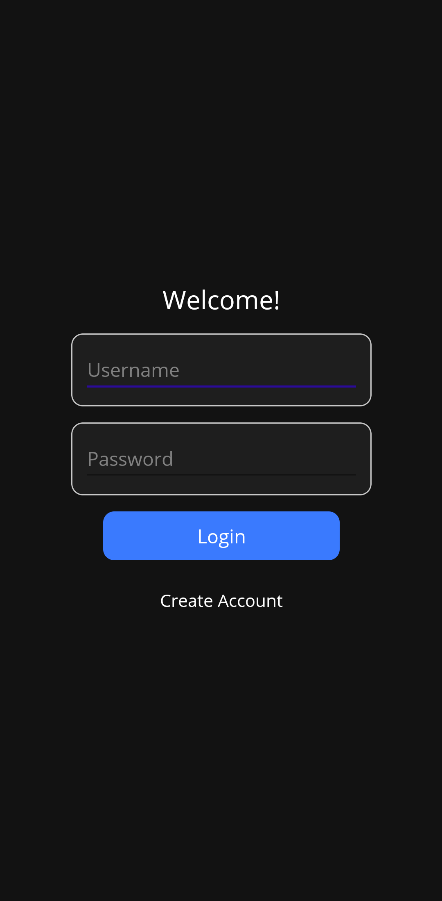
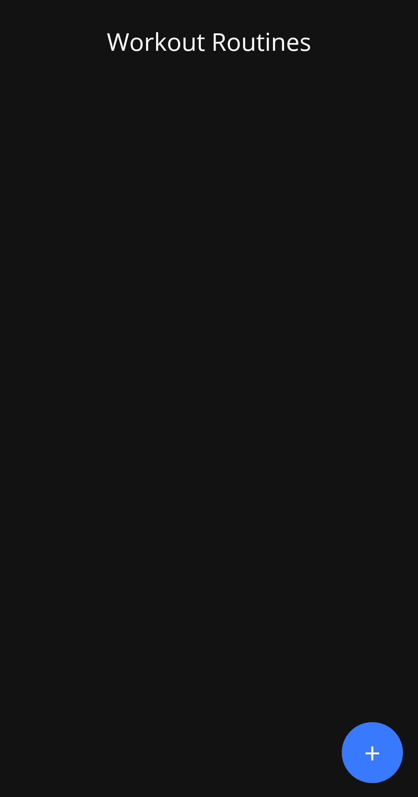
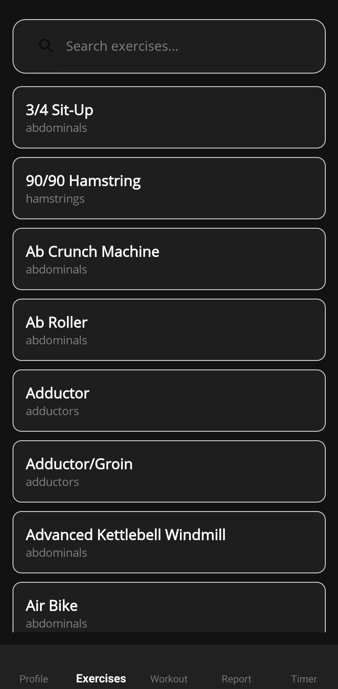
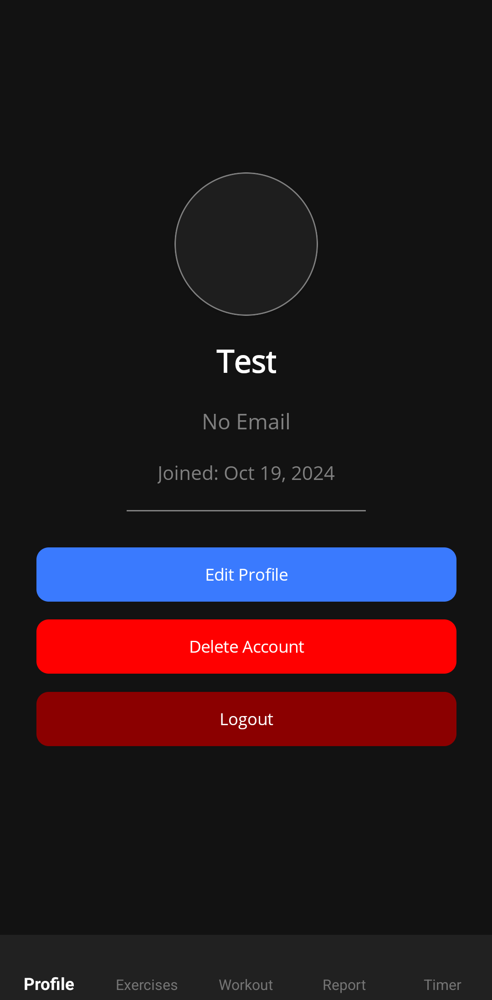
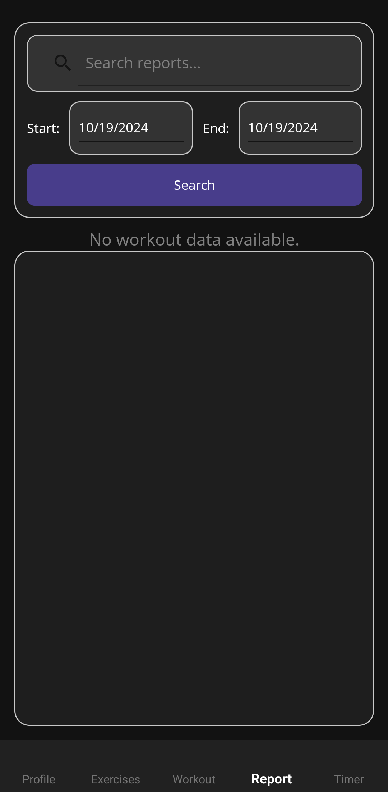
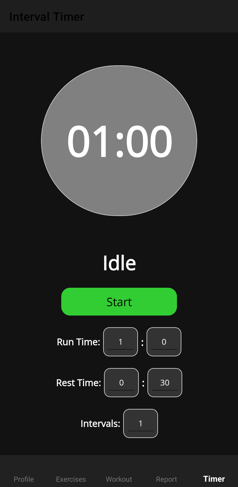

# 🏋️ Workout Tracker Mobile App

A cross-platform workout tracking app built with **.NET MAUI** and **MVVM Community Toolkit**.  
Create, manage, and track your workouts — anytime, anywhere.

---

## ✨ Features

- 🔐 User Registration & Login
- 📋 Manage Workout Routines
- 🏃‍♂️ Exercise Library with Search
- 📊 Workout History & Reports
- ⏱ Interval Timer
- 🧑 Profile Management
- 💾 Local data storage (no internet required)
- ⚡ Modern & minimalist UI

---

## 📸 Screenshots

### 🔐 Login Page

### 🏠 Home Page (Workout Routines)

### 🏋️ Exercise Page

### 🙋 Profile Page

### 📈 Report Page

### ⏱ Timer Page

---

## 🛠️ Tech Stack

- .NET MAUI
- MVVM Community Toolkit
- C#
- XAML
- SQLite / Local Storage

---

## ✅ Why This Project?

#### This app was developed as a Software Engineering Capstone Project to demonstrate:
- Modern cross-platform mobile development with .NET MAUI
- Real-world MVVM implementation
- Clean UI/UX with XAML
- Local data persistence without external dependencies
- Practical exercise and workout tracking
- Offline data persistence and clean UI

---

## 💡 Future Improvements
- Add progress tracking (graphs & stats)
- Cloud sync for workouts